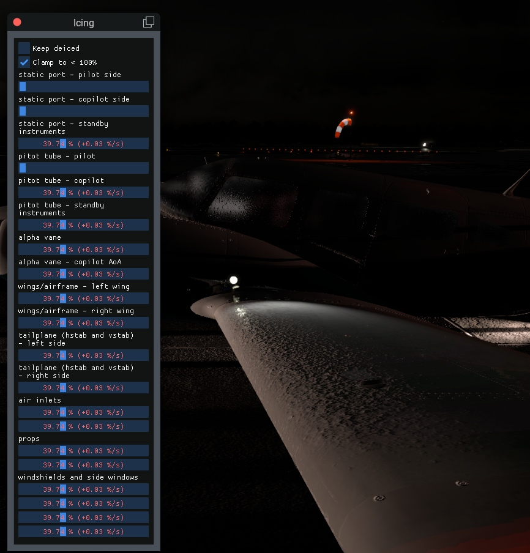

# X-Plane FlyWithLua plugin "Icing"

## What it does

This adds a dialog that shows aicraft ice accretion and allows to change it.

Remark: If you just want to see ice accretion quickly, you can also use the built-in X-Plane data outputs "Ice Accretion".

## Requirements

* FlyWithLua [NG for X-Plane 11](https://forums.x-plane.org/index.php?/files/file/38445-flywithlua-ng-next-generation-edition-for-x-plane-11-win-lin-mac/) or [NG+ for X-Plane 12](https://forums.x-plane.org/index.php?/files/file/82888-flywithlua-ng-next-generation-plus-edition-for-x-plane-12-win-lin-mac/)
* Tested with X-Plane 12

## Installation

Put the .lua file into `./Resources/plugins/FlyWithLua/Scripts/`.

## Usage

### Quickstart

* Open the dialog via the FlyWithLua menu: Plugins → FlyWithLua → FlyWithLua Macros → Icing: Toggle settings window
  * or bind the command `Icing/ToggleSettings` to a key or joystick button
* The dialog should be pretty self-explanatory.

### All command refs

#### `Icing/ToggleSettings`
Show/hide the settings window

## Help

If you have problems, feedback or ideas you can open an
[issue on Github](https://github.com/jonaseberle/xplane-plugin-icing/issues)
or post in the
[comments for the download on the x-plane.org forum](https://forums.x-plane.org/index.php?/files/file/89907-icing-%E2%80%93-inspect-and-change-aircraft-ice-accretion/).
